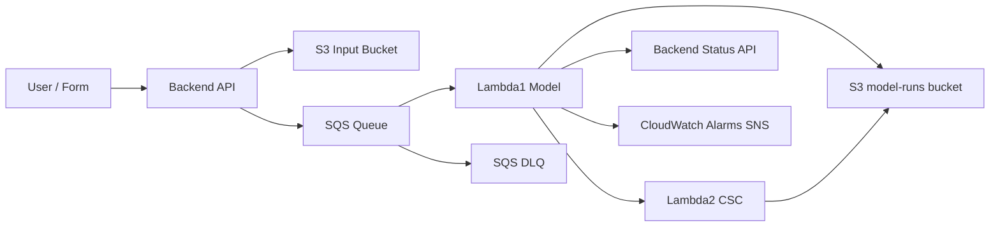
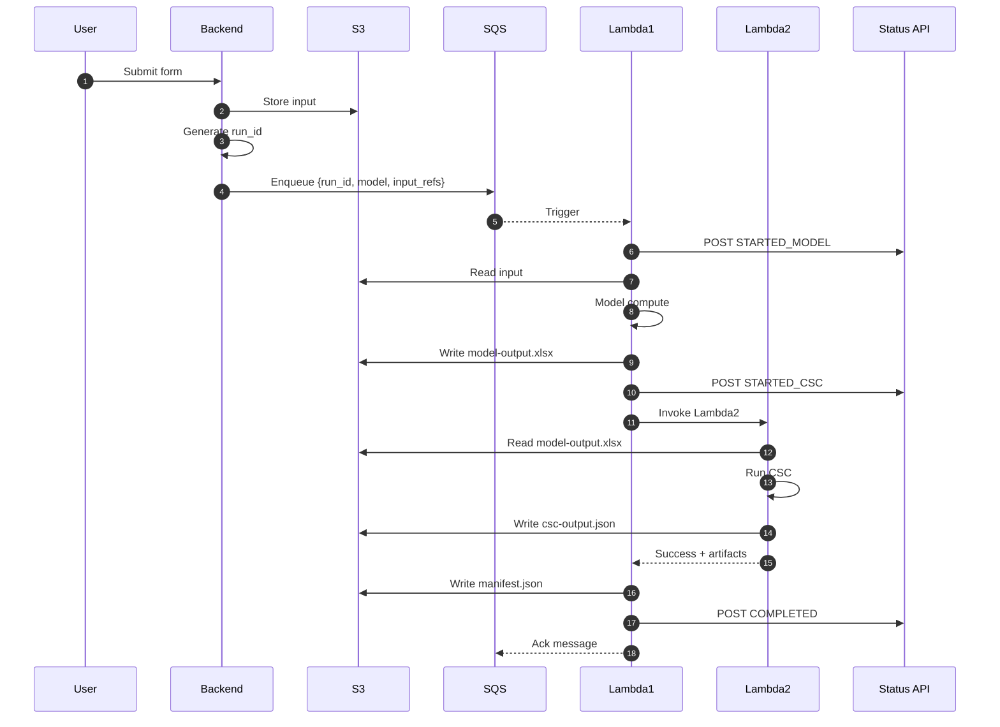
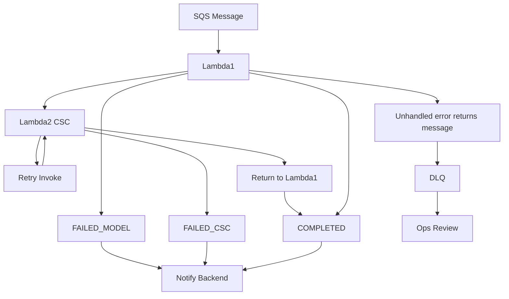

# Two‑Lambda Chaining Approach (Without Step Functions)

You’ve chosen the direct Lambda chaining model (Option A): SQS → Lambda 1 (model-specific) → invoke Lambda 2 (shared CSC executable) → notify backend.

This file has been updated to include simplified, GitHub‑compatible Mermaid diagrams after prior render errors.  
Styling, special characters, long edge labels, and HTML have been removed to ensure compatibility.

---

## 1. High-Level Event Flow (Simplified Mermaid)



### ASCII Fallback

```
User/Form -> Backend -> S3 (inputs)
Backend -> SQS
SQS -> Lambda1
Lambda1 -> S3 (model artifacts)
Lambda1 -> Lambda2 (CSC)
Lambda2 -> S3 (CSC outputs)
Lambda1 -> Backend (status)
SQS retries -> DLQ
CloudWatch Alarms -> SNS
```

---

## 2. Detailed Sequence (Happy Path – Simplified)



---

## 3. Failure / Retry Flow (Simplified Mermaid)



### ASCII Fallback

```
SQS -> Lambda1
Lambda1:
  Model error -> FAILED_MODEL -> Notify
  Else invoke Lambda2
Lambda2:
  Transient -> retry loop
  Success -> return -> COMPLETE
  Exhausted or fatal -> FAILED_CSC -> Notify
Unhandled Lambda1 error -> message reappears -> DLQ after maxReceiveCount
```

---

## 4. Status Lifecycle

```
RECEIVED -> QUEUED -> STARTED_MODEL
  -> FAILED_MODEL (terminal)
  -> STARTED_CSC -> FAILED_CSC (terminal) -> COMPLETED
(retry path: STARTED_CSC -> RETRYING_CSC -> STARTED_CSC)
```

---

## 5. Key Implementation Points (Unchanged)

- SQS visibility timeout > (Lambda1 + Lambda2 worst case + retry buffer)
- Lambda1 orchestrates and posts all statuses
- Lambda2 returns structured payload: {status, error_type?, csc_artifacts?}
- Retry only transient CSC errors (one extra attempt)
- Use S3 for all artifacts; manifest consolidates outputs
- DLQ monitored via CloudWatch alarm (depth > 0 for 5m)
- Structured logs include: run_id, stage, event, attempt, error_type

---

## 6. Pseudocode (Previously Provided – Reference Only)

Lambda1 orchestrator and Lambda2 CSC executor pseudocode retained (no changes).  
If you would like them re-included here or adjusted (e.g., adding exponential backoff constants, circuit breaker pattern), request an update.

---

## 7. Minimal SQS Message Schema

```json
{
  "run_id": "uuid-v4",
  "model": "obligation",
  "input_refs": {
    "bucket": "model-inputs",
    "key": "requests/2025/09/11/run_id/input.json"
  },
  "submitted_at": "2025-09-11T12:34:56Z"
}
```

---

## 8. Common Mermaid Troubleshooting Tips

| Issue | Cause | Fix |
|-------|-------|-----|
| Parse error near line with `|Label|` | Edge label syntax conflicts | Remove label or simplify text |
| Hex color parse error | Old Mermaid version quirks | Remove styling / classDef |
| Brackets inside node text | Some shapes not supported | Use simple `[Text]` |
| HTML `<br/>` not rendering | GitHub strips or parser rejects | Use spaces or separate nodes |

Test diagrams at https://mermaid.live if in doubt.

---

## 9. Next Optional Enhancements

| Enhancement | Benefit |
|------------|---------|
| Add correlation ID header to status POST | Traceability across services |
| Implement circuit breaker for repeated CSC transient failures | Protect resources |
| Add manifest checksum & artifact size metadata | Integrity & audit |
| Add Slack formatted alert (JSON to Webhook) | Faster ops response |
| Introduce per-model concurrency guard (Reserved Concurrency) | Prevent starvation |

---

## 10. Summary

The diagrams are now simplified to maximize GitHub Mermaid compatibility.  
Let me know if you’d like:
- Reintroduction of styling after confirmation
- Additional diagrams (artifact lifecycle, retry timing)
- Terraform / CDK scaffolding
- Alert rule JSON templates

Just ask for the specific artifact and I’ll generate it.

---
