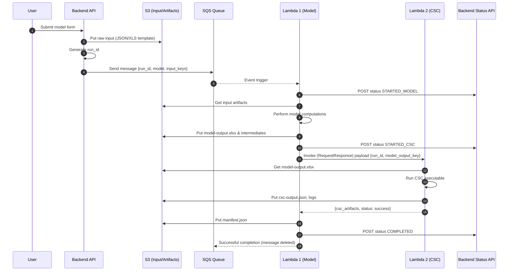

# Two‑Lambda Chaining Approach (Without Step Functions)

You’ve chosen the simpler “direct Lambda chaining” model (Option A): SQS → Lambda 1 (model-specific) → invoke Lambda 2 (shared CSC executable) → notify backend.

This document gives:
1. Diagrammatic flows (multiple views)
2. Implementation steps / phased plan
3. Operational considerations
4. Pseudocode scaffolding
5. Risk & mitigation snapshot
6. Structured questions to finalize with the client

---

## 1. High-Level Event Flow

```mermaid
flowchart LR
    A[User/Form Submission] --> B[Backend API]
    B -->|Persist input + store raw file (S3)| S3[(S3 Input Bucket)]
    B -->|Send SQS Message<br/>{run_id, model, input_refs}| Q[SQS Queue]

    Q -->|Trigger| L1[Lambda 1<br/>Model-Specific]

    L1 -->|PUT artifacts| S31[(S3 /model-runs/{run_id}/)]
    L1 -->|Sync invoke| L2[Lambda 2<br/>CSC Executor]
    L2 -->|PUT CSC outputs| S31

    L1 -->|POST status updates| BE[Backend Status Endpoint]
    L1 -->|On success FINAL status COMPLETED| BE
    L1 -->|On failure FAILED_*| BE

    Q -->|Failures after retries| DLQ[(SQS DLQ)]
    L1 -->|Alerts (CloudWatch Alarms)| SNS[(SNS -> Email/Slack)]
```

---

## 2. Detailed Sequence (Happy Path)



---

## 3. Failure / Retry Flow (Condensed)

```mermaid
flowchart TB
    subgraph SQS Flow
        Q[SQS Message] --> L1[Lambda 1]
    end

    L1 -->|Model Error| F1[Failure Handler<br/>FAILED_MODEL]
    L1 -->|Transient CSC Error? (Retry)| R2[Retry L2 Invoke]
    R2 -->|Max Attempts Exceeded| F2[Failure Handler<br/>FAILED_CSC]
    L1 -->|CSC Success| S[Finalize + COMPLETED]

    F1 --> BK[Backend Status API]
    F2 --> BK
    S --> BK

    L1 -->|Unhandled Exception / Timeout| SQS_Retry[Message Reappears]
    SQS_Retry -->|Redrive count > maxReceiveCount| DLQ[(DLQ)]

    DLQ --> A[Ops Review & Optional Replay]
```

---

## 4. Component Responsibility Table

| Component | Responsibility | Key Outputs |
|-----------|---------------|-------------|
| Backend API | Validate input, create run_id, enqueue SQS message | SQS message |
| SQS Queue | Decouple ingestion & execution | Event to Lambda 1 |
| Lambda 1 | Model logic, orchestrate Lambda 2, status lifecycle | Artifacts, status updates |
| Lambda 2 | Run CSC executable, produce shared outputs | CSC outputs (JSON/logs) |
| S3 | Persistent artifact store | XLS, JSON, logs, manifest |
| Backend Status API | Persist & expose run statuses | UI/Reporting state |
| DLQ | Capture unrecoverable triggers | Failure diagnostics |
| CloudWatch/SNS | Observability & alerts | Notifications |

---

## 5. Implementation Steps (Phased Plan)

### Phase 0 – Decisions / Clarifications
- Confirm execution time budgets (Model & CSC)
- Confirm maximum artifact sizes
- Select runtime & architecture (x86_64 if CSC binary requires; else consider arm64)
- Confirm memory footprint of CSC executable

### Phase 1 – Infrastructure as Code
Provision (CloudFormation / SAM / CDK / Terraform):
- S3 buckets: `inputs`, `model-runs` (encryption + versioning + lifecycle)
- SQS primary + DLQ (redrive policy, encryption, visibility timeout)
- Lambda 1 function (reserved concurrency optional)
- Lambda 2 function (higher memory if needed; ephemeral storage size override)
- IAM roles (least privilege with resource-level S3 restrictions)
- Secrets (AWS Secrets Manager / SSM Parameter Store for CSC endpoint/API keys)
- CloudWatch log groups + retention
- SNS topics + subscription (Email/Slack via webhook)
- Metrics dashboards

### Phase 2 – Lambda 2 Packaging
- Bundle CSC executable
- Validate cold-start size (zip limit 50MB zipped / 250MB unzipped; else container image)
- Add wrapper script for error classification → map to error types (`CSC.TransientError`, `CSC.FatalError`)
- Implement memory/time profile (benchmark)

### Phase 3 – Lambda 1 Development
- Message parsing → validate schema
- Status posting helper (idempotent POST with run_id)
- Model computation module (pluggable strategy per model)
- Artifact writer (S3 put with tags: run_id, stage=model)
- Manifest builder (collect artifact metadata)
- Lambda 2 invocation logic with:
  - Timeout guard (ensure `remaining_time_in_millis > safety_margin`)
  - Retry for transient errors (1 attempt configurable)
  - Structured logging (JSON)

### Phase 4 – Backend Status API
- Endpoint: POST `/runs/{run_id}/status`
- Accept body: { status, stage, attempt, failure_reason?, artifacts? }
- Idempotent: Upsert by run_id + stage
- Emit internal event (optional) for UI or analytics

### Phase 5 – Observability & Alarms
- Metrics published:
  - `RunsStarted`, `RunsCompleted`, `RunsFailedModel`, `RunsFailedCSC`
  - `ModelDurationMs`, `CSCDurationMs`
- Alarms:
  - Failure ratio > X% over 15m
  - DLQ message count >= 1 sustained > 5m
  - Lambda 2 Duration p95 near timeout threshold
  - Concurrency throttle count > 0

### Phase 6 – Testing
- Unit tests (model logic, CSC wrapper)
- Integration tests (mock SQS -> L1 -> L2)
- Load tests (parallel runs near expected peak)
- Chaos tests (simulate CSC downtime to verify failure classification & alerting)

### Phase 7 – Runbook & Handover
- Document replay procedure (moving DLQ message back to main queue)
- SOP for CSC outage escalation
- Capacity review guidelines

---

## 6. Operational Considerations

| Aspect | Guidance |
|--------|---------|
| SQS Visibility Timeout | Must exceed (L1 total runtime + L2 invocation + retry margin). E.g., if max combined = 6 min, set 10–12 min. |
| Lambda 1 Timeout | Slightly > (max model time + max CSC time + overhead); keep buffer for notifying backend. |
| Lambda 2 Timeout | Tight to CSC process expected max; fail fast if exceeded. |
| Idempotency | Use `run_id`; backend prevents duplicate status confusion. Optional: hash inputs to detect duplicates. |
| Retries (L2) | 1 internal retry for transient network errors; classify errors explicitly. |
| DLQ Strategy | Only after Lambda 1 unhandled exception/timeout repeats `maxReceiveCount` (e.g., 2–3). |
| Security | Enforce KMS encryption on SQS/S3; restrict PutObject to path prefix `model-runs/${run_id}/*`. |
| Logging | Structured JSON: `{timestamp, run_id, stage, level, msg, attempt, elapsed_ms}` |
| Cost Control | Aggregate large artifacts to single XLS where possible; purge old runs via S3 lifecycle (e.g., >90 days). |

---

## 7. Example Status Lifecycle

1. RECEIVED (Backend internal)
2. QUEUED (SQS)
3. STARTED_MODEL
4. FAILED_MODEL (terminal) OR STARTED_CSC
5. FAILED_CSC (terminal) OR COMPLETED

Optional intermediate: RETRYING_CSC

---

## 8. Pseudocode Sketches

### Lambda 1 (Model Orchestrator)

```python
import json, os, time, boto3
from botocore.exceptions import ClientError

s3 = boto3.client('s3')
lambda_client = boto3.client('lambda')
http = boto3.client('lambda')  # or use requests if VPC allowed

BACKEND_STATUS_URL = os.environ['STATUS_ENDPOINT']
LAMBDA2_NAME = os.environ['LAMBDA2_NAME']
ARTIFACT_BUCKET = os.environ['ARTIFACT_BUCKET']

def post_status(run_id, status, stage=None, attempt=None, reason=None, artifacts=None):
    payload = {
        "run_id": run_id,
        "status": status,
        "stage": stage,
        "attempt": attempt,
        "failure_reason": reason,
        "artifacts": artifacts or []
    }
    # Use API Gateway signed request or VPC-internal call (omitted)
    # Must be idempotent
    print(json.dumps({"event":"status_post","payload":payload}))

def handler(event, context):
    # SQS batch → iterate per record (assume batch size = 1 recommended)
    record = event['Records'][0]
    body = json.loads(record['body'])
    run_id = body['run_id']
    model = body['model']
    input_refs = body['input_refs']

    start_time = time.time()
    post_status(run_id, "STARTED_MODEL", stage="MODEL", attempt=1)

    try:
        model_output_key = run_model_logic(run_id, model, input_refs)
    except ValidationError as ve:
        post_status(run_id, "FAILED_MODEL", stage="MODEL", reason="VALIDATION_ERROR")
        raise
    except Exception as e:
        post_status(run_id, "FAILED_MODEL", stage="MODEL", reason="MODEL_RUNTIME_ERROR")
        raise

    post_status(run_id, "STARTED_CSC", stage="CSC", attempt=1)

    # Invoke Lambda 2
    attempts = 0
    max_attempts = 2  # initial + 1 retry
    while attempts < max_attempts:
        attempts += 1
        try:
            resp = lambda_client.invoke(
                FunctionName=LAMBDA2_NAME,
                InvocationType='RequestResponse',
                Payload=json.dumps({
                    "run_id": run_id,
                    "model_output_key": model_output_key
                })
            )
            payload = json.loads(resp['Payload'].read().decode())
            if payload.get("status") == "success":
                # Build manifest
                manifest_key = write_manifest(run_id, model_output_key, payload['csc_artifacts'])
                post_status(run_id, "COMPLETED", stage="FINAL", artifacts=[
                    {"type":"model_xls","s3_key":model_output_key},
                    *payload['csc_artifacts'],
                    {"type":"manifest","s3_key":manifest_key}
                ])
                return {"ok": True}
            else:
                raise RuntimeError(payload.get("error","CSC_UNKNOWN_ERROR"))
        except TransientCSCError:
            if attempts < max_attempts:
                post_status(run_id, "RETRYING_CSC", stage="CSC", attempt=attempts+1, reason="TRANSIENT")
                time.sleep(3 * attempts)
                continue
            post_status(run_id, "FAILED_CSC", stage="CSC", attempt=attempts, reason="TRANSIENT_MAX_RETRIES")
            raise
        except Exception as e:
            post_status(run_id, "FAILED_CSC", stage="CSC", attempt=attempts, reason="CSC_FATAL")
            raise
```

### Lambda 2 (CSC Executor Skeleton)

```python
import os, json, subprocess, tempfile, boto3, time

s3 = boto3.client('s3')
ARTIFACT_BUCKET = os.environ['ARTIFACT_BUCKET']
CSC_BINARY = "/var/task/csc_exec"  # or layer path

def handler(event, context):
    run_id = event['run_id']
    model_output_key = event['model_output_key']

    local_model_file = "/tmp/model-output.xlsx"
    s3.download_file(ARTIFACT_BUCKET, model_output_key, local_model_file)

    try:
        start = time.time()
        result = subprocess.run(
            [CSC_BINARY, "--input", local_model_file, "--json-out", "/tmp/csc-output.json"],
            capture_output=True,
            timeout=600
        )
        if result.returncode != 0:
            stderr = result.stderr.decode()
            if "timeout" in stderr.lower() or "retryable" in stderr.lower():
                return {"status":"error","error_type":"TRANSIENT","stderr":stderr}
            return {"status":"error","error_type":"FATAL","stderr":stderr}

        # Upload outputs
        csc_out_key = f"model-runs/{run_id}/csc-output.json"
        s3.upload_file("/tmp/csc-output.json", ARTIFACT_BUCKET, csc_out_key)

        csc_log_key = f"model-runs/{run_id}/csc-log.txt"
        s3.put_object(
            Bucket=ARTIFACT_BUCKET,
            Key=csc_log_key,
            Body=result.stderr or result.stdout
        )
        return {
            "status":"success",
            "csc_artifacts":[
                {"type":"csc_output","s3_key":csc_out_key},
                {"type":"csc_log","s3_key":csc_log_key}
            ],
            "duration_ms": int((time.time()-start)*1000)
        }
    except subprocess.TimeoutExpired:
        return {"status":"error","error_type":"TRANSIENT","error":"TIMEOUT"}
    except Exception as e:
        return {"status":"error","error_type":"FATAL","error":str(e)}
```

---

## 9. Risk & Mitigation Snapshot

| Risk | Impact | Mitigation |
|------|--------|-----------|
| Combined runtime exceeds Lambda 1 timeout | False failures | Size timeouts with margin; track durations |
| CSC binary size too large | Deployment failure | Use Lambda container image |
| Transient CSC outages | Frequent FAIL runs | Implement classification + single retry |
| Slow backend status API | Delays/Time lost | Async fire-and-forget with short timeout; queue fallback |
| Duplicate SQS messages | Double processing | Idempotent run_id & backend status upsert |
| Large XLS > /tmp space | Crashes | Increase ephemeral storage or stream to S3 | 
| Lack of visibility | Hard debugging | Structured logs + correlation run_id |
| DLQ growth unnoticed | Silent failures | CloudWatch alarm on DLQ > 0 |

---

## 10. Client Clarification Questions

Group these and send in a structured RFI (Request for Information).

### Functional
1. List of models initially supported? (names, versioning strategy)
2. Expected maximum number of concurrent runs per model?
3. Are partial outputs valuable if CSC fails (should we surface MODEL_SUCCESS + CSC_FAILED separately)?

### Input / Data
4. Maximum input payload size (JSON, XLS templates)?
5. Are inputs always stored in S3 or sometimes inline in SQS message?
6. Required retention period for artifacts (XLS, logs, JSON outputs)?

### Execution Constraints
7. Typical and worst-case model compute time?
8. Typical and worst-case CSC execution time?
9. Peak daily run volume (total and per model)?

### CSC Executable
10. Memory and CPU requirements observed historically?
11. Is the executable updated frequently? Need rollout/version tagging (csc_version)?
12. Any licensing / compliance restrictions on execution environment?

### Error Handling
13. List of known transient vs fatal CSC errors (patterns to detect)?
14. What is acceptable retry delay for CSC transient failures?
15. Shall we expose a manual “re-run” endpoint for failed runs?

### Status & UX
16. Do users need to see intermediate status (e.g., STARTED_CSC) in UI?
17. SLA for marking a run as FAILED after an internal error (immediate vs delayed classification)?

### Security & Compliance
18. Data classification level (PII? FOUO? etc.) influencing encryption & access logs?
19. Required encryption keys (dedicated KMS CMK vs AWS-managed)?
20. Required audit logs (format, retention period)?

### Access & IAM
21. Who needs access to raw artifacts (roles, teams)?
22. Is cross-account access required (analytics account, audit account)?

### Observability
23. Preferred alert channels (Slack, Email, PagerDuty)?
24. Thresholds for alerting (failure ratio %, latency p95)?
25. Need for cost dashboards per model?

### Performance & Scaling
26. Acceptable average queue wait time (ingestion to start)?
27. Concurrency caps per model to protect downstream CSC?

### Operations
28. Run cancellation needed? If yes, do we soft-cancel only if still in queue?
29. Replay from DLQ: auto or manual approval required?
30. Schedule maintenance windows for CSC downtime?

### Data Governance
31. Artifact lifecycle requirements (auto-delete after X days? except some flagged runs)?
32. Need for checksum or digital signing of outputs?

### Future Evolution
33. Expected probability of needing a third stage in next 6–12 months?
34. Interest in migrating to Step Functions later for increased complexity?
35. Need for lineage tracking (parent_run_id, re-run chains)?

### API / Integration
36. Backend status endpoint throughput limit (QPS)?
37. Do you require OAuth/API key rotation schedule?

### Compliance / Auditing
38. Reporting requirements: monthly run volume, failure categorization?
39. Need for immutable logs (CloudTrail Lake, external SIEM integration)?

---

## 11. Sample SQS Message Schema (Proposed)

```json
{
  "schema_version": "1.0",
  "run_id": "uuid-v4",
  "model": "obligation",
  "input_refs": {
    "bucket": "model-inputs",
    "key": "requests/2025/09/11/run_id/input.json"
  },
  "requested_by": "user_id_or_email",
  "submitted_at": "2025-09-11T12:34:56Z",
  "idempotency_key": "sha256(model+normalized_input)"
}
```

---

## 12. Artifact Naming Convention

`model-runs/{run_id}/`
- `input.json`
- `model-output.xlsx`
- `intermediate/*.json`
- `csc-output.json`
- `csc-log.txt`
- `manifest.json`

Manifest Example:

```json
{
  "run_id": "uuid",
  "model": "obligation",
  "artifacts": [
    {"type":"input","key":"model-runs/uuid/input.json","checksum":"sha256:..."},
    {"type":"model_output","key":"model-runs/uuid/model-output.xlsx"},
    {"type":"csc_output","key":"model-runs/uuid/csc-output.json"},
    {"type":"csc_log","key":"model-runs/uuid/csc-log.txt"}
  ],
  "model_version": "2025.09.1",
  "csc_version": "2.4.7",
  "completed_at": "2025-09-11T12:45:10Z"
}
```

---

## 13. Logging Fields (Minimum)

| Field | Description |
|-------|-------------|
| timestamp | ISO8601 |
| run_id | Correlation id |
| stage | MODEL / CSC / FINAL |
| event | high-level event name |
| level | INFO / WARN / ERROR |
| attempt | numeric attempt count |
| duration_ms | optional per sub-step |
| error_type | classification |
| message | human-readable |

---

## 14. CloudWatch Metrics (Custom Namespace: `ModelPipeline`)

| Metric | Dimensions | Description |
|--------|------------|-------------|
| RunsStarted | model | Count of triggered runs |
| RunsCompleted | model | Successful completions |
| RunsFailedModel | model | Failures in model stage |
| RunsFailedCSC | model | Failures in CSC stage |
| ModelDurationMs | model | End - start (stage) |
| CSCDurationMs | model | Stage time |
| Lambda2MemoryUtilization (if via logs) | model | Observed memory high-water |
| DLQDepth | - | DLQ message count |

Alarms:
- `RunsFailedModel / RunsStarted > 0.2` over 15m
- `RunsFailedCSC / RunsStarted > 0.2` over 15m
- `DLQDepth > 0` for 5m
- `Lambda2 Duration p95 > (Timeout * 0.8)` 3 datapoints

---

## 15. Migration Path (Optional Future)

If complexity increases:
- Introduce Step Functions with minimal refactor (L1 logic stays; orchestration removed from L1)
- Split notify steps & retries into state machine
- Add parallel branches for additional derived outputs

---

## 16. Quick “Go / No-Go” Checklist Before Launch

| Item | Status |
|------|--------|
| Visibility timeout sized correctly |  |
| Lambda timeouts sized w/ buffer |  |
| CSC binary profiled & memory tuned |  |
| Status API idempotency verified |  |
| DLQ alarm active |  |
| Retry classification tested |  |
| Manifest integrity validated |  |
| Security review (IAM least privilege) |  |
| Secrets / endpoints not hard-coded |  |
| Load test run at projected peak |  |
| Runbook published |  |

---

## 17. ASCII Fallback (Simplified)

```
User -> Backend -> SQS -> Lambda1 -> (Model compute) -> S3
                                  -> Invoke Lambda2 -> (CSC exec) -> S3
                                  -> Build manifest -> Notify Backend
Failures: Lambda1 exception -> SQS retry -> DLQ (after max)
          Lambda2 failure -> handled inside Lambda1 -> status FAILED_CSC
```

---

## 18. Summary

You now have:
- Clear direct-chaining flow
- Robust scaffolding for retries, logging, and status handling
- A comprehensive question set to close gaps
- A path to scale or migrate later without rework

Let me know if you’d like:
- Terraform / CDK skeletons
- CloudWatch dashboard JSON
- Sample manifest validator
- Slack alert formatting examples

Happy to generate those next.

---
